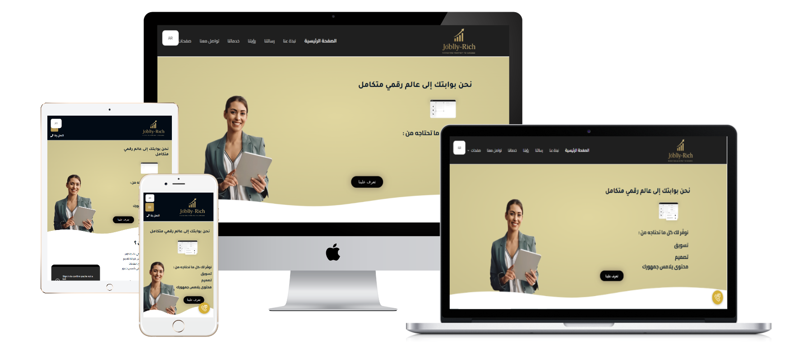
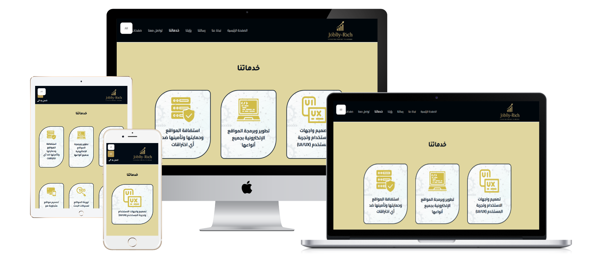
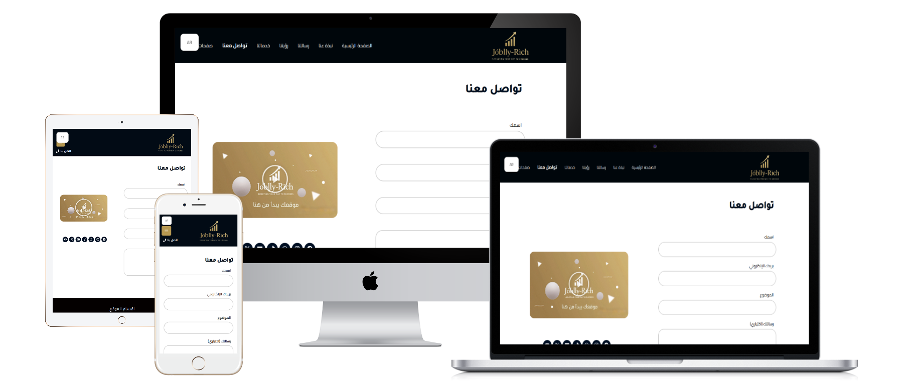
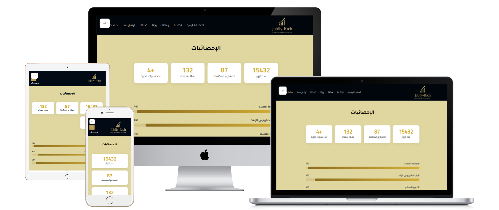
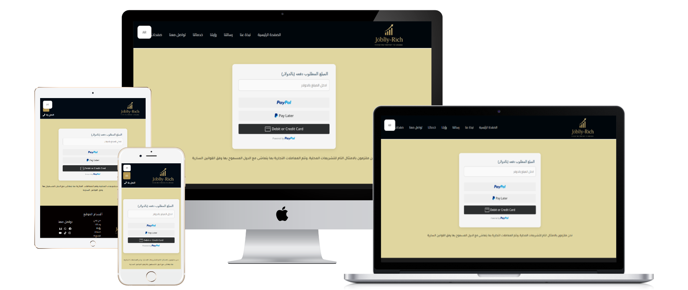

# Joblly-Rich-website-design-your-gateway-to-a-complete-digital-world
A multilingual corporate website offering website development, UI/UX design, SEO, website hosting and security, and electronic payment system integration services.

## pictures

## 📝 الوصف القصير للمشروع
- العميل: Joblly-Rich – شركة متخصصة في تطوير وبناء المواقع الإلكترونية.
- نوع الموقع: موقع مؤسسي متعدد اللغات يعرض خدمات تطوير المواقع، تصميم واجهات المستخدم (UI/UX)، تحسين محركات البحث (SEO)، استضافة وتأمين المواقع، وتكامل أنظمة الدفع الإلكترونية.
- الهدف من التصميم: إنشاء موقع احترافي يعكس هوية الشركة ويقدم خدماتها بشكل جذاب وسهل الاستخدام، مع التركيز على تجربة المستخدم والأداء التقني.
- التقنيات المستخدمة: WordPress | Elementor |  HTML | CSS | JavaScript | SEO | تصميم متجاوب (Responsive Design)

## 💡 المميزات والتفاصيل الإضافية
- تصميم واجهات المستخدم (UI/UX): تصميم واجهات مستخدم مبتكرة وسهلة الاستخدام تضمن تجربة مستخدم متميزة.
- تحسين محركات البحث (SEO): تنفيذ استراتيجيات SEO فعّالة لزيادة ظهور الموقع في نتائج محركات البحث وجذب الزوار المستهدفين.
- استضافة وتأمين المواقع: توفير حلول استضافة موثوقة وآمنة، مع تنفيذ إجراءات تأمين لحماية الموقع من التهديدات الإلكترونية.
- تكامل أنظمة الدفع الإلكترونية: دمج أنظمة دفع إلكترونية متعددة لتسهيل المعاملات المالية عبر الموقع.
- دعم فني مستمر: تقديم دعم فني مستمر وتحديثات دورية لضمان استمرارية أداء الموقع.

## 🔗 رابط الموقع: https://joblly-rich.com/
